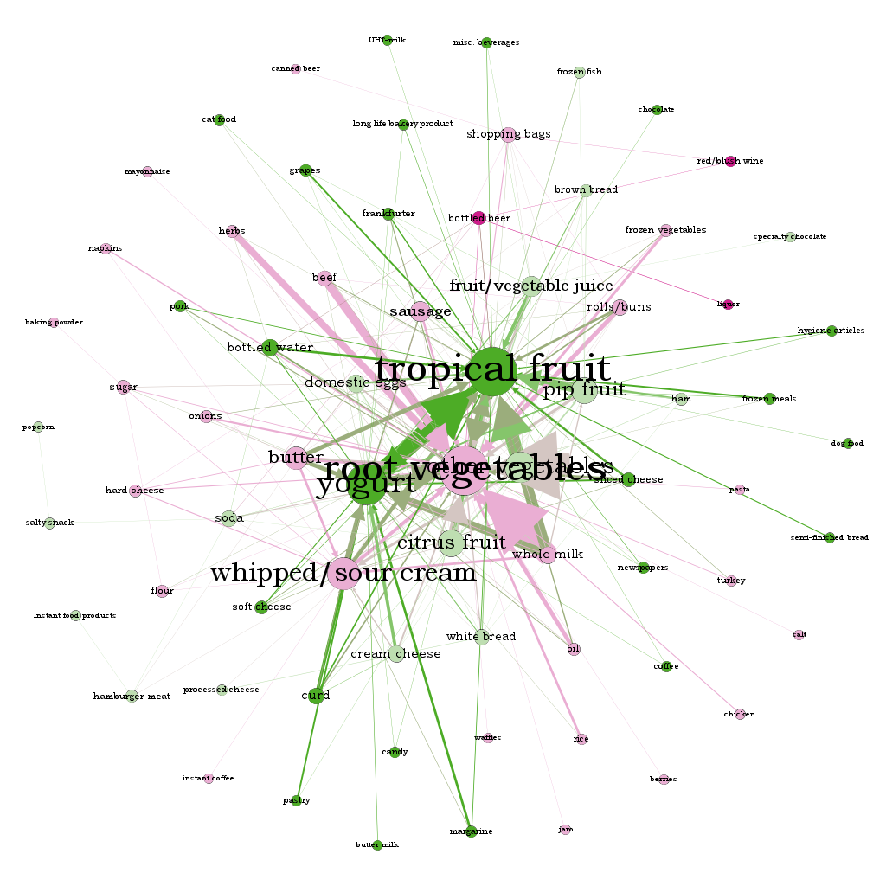

```{r setup, include=FALSE}
knitr::opts_chunk$set(echo = TRUE)
```

### Probability Practice
#### Part A
* Total probability of an yes $P(Y) = 0.65$
* Probability of an yes given the click is by a random clicker $P(Y/RC) = 0.5$
* Probability of a clicker being a random clicker $P(RC) = 0.3$
* Probability of a clicker being a truthful clicker $P(TC) = 0.7$

Let's consider the total probability equation of yes to get started with:
Total probability $P(Y)$ =  
Joint probability of Yes and Random Clickers $P(Y,RC)$ +Joint probability of Yes and Random Clickers $P(Y,TC)$   
i.e $P(Y) = P(Y,RC) + P(Y,TC)$  
=>  $P(Y) = P(Y/RC)*P(RC) + P(Y/TC)*P(TC)$  
=>  $P(Y/TC)*P(TC) = P(Y) - P(Y/RC)*P(RC)$  
=>  $P(Y/TC) = (P(Y) - P(Y/RC)*P(RC))/P(TC)$  
Substituting the given values    
$P(Y/TC) = (0.65 - (0.5*0.3))/0.7

**Fraction of people who are truthful clickers answered yes = $5/7$**  


## Wrangling the Billboard Top 100
### Part A: Make a table of the top 10 most popular songs since 1958.

```{r,echo=FALSE,include=FALSE}
library('dplyr')
df_billboard <- read.csv(file = 'billboard.csv')
new_billboard = df_billboard %>% group_by(song, performer)%>%
                                 summarise(count=n())
final<-arrange(new_billboard,desc(new_billboard$count))
top10_songs<-head(final,10)
```

```{r,echo=FALSE}
top10_songs
```

* The above table displays the top 10 most popular songs since 1958 based on the total number of weeks that a song spent on the Billboard Top 100.


### Part B: Is the "musical diversity" of the Billboard Top 100 changing over time?

```{r,echo=FALSE}
new_df <- df_billboard[df_billboard$year != '1958' & df_billboard$year!='2021',]
test_df<-new_df%>%group_by(year)%>%summarise(distinct_songs = n_distinct(song))
library(ggplot2)
ggplot(data=test_df, aes(x=year, y=distinct_songs,group=1)) +
  geom_line(color="#aa0022", size=1.25) +
  geom_point(color="#aa0022", size=3.5)+ggtitle("Musical Diversity of the Billboard Top 100") +
  labs(x="Year", y="Number of unique songs")
```

* The above line graph shows the number of distinct songs in the Billboard top 100 in each year from 1959 to 2020. As we can see, the number of distinct songs in the years 1965-1970 were pretty high but consistently decreased after that until the year 2000. From the year 2000, the number of distinct songs consistently increased  till the year 2020.

### Part C: Ten-week hit

```{r,echo=FALSE}
ten_week<-df_billboard%>%group_by(song,performer)%>%summarise(count_weeks=n())
temp0<-ten_week%>%filter(count_weeks>=10)
temp1<-temp0%>%group_by(performer)%>%summarise(count_songs=n())
temp2<-temp1%>%filter(count_songs>=30)
ggplot(temp2, aes(x=count_songs, y=performer))+geom_bar(stat = "identity",color="#aa0022")+labs(x = "Number of ten week hits", y = "Artist") + scale_fill_brewer(breaks=c("local", "imported"), palette = "Set1")
```

* The bar plot shows the artists who have atleast 30 songs that appeared in the top 100 billboard list for more than 10 weeks. Elton John has is on the top of the list with 52 ten week hit songs followed by Madonna, Kenny Chesney, Tim McGraw and Keith Urban in the top 5 

## Visual story telling part 1: Green Buildings

```{r,echo=FALSE}
green_buildings=read.csv("greenbuildings.csv")
nrow(green_buildings)
buildings_1 <-subset(green_buildings, leasing_rate>10)
nrow(buildings_1)
```

* Green buildings in each cluster should be compared to non-green buildings in the same cluster. This will give us the advantage of a green building if any financially. I agree with the excel guru that buildings with less than 10% occupancy need to be removed. There are 215 such buildings 

#similar green buildings
```{r,echo=FALSE}
gb <- subset(buildings_1, stories<16 & stories>14 & green_rating==1 & size>200000 & size<300000)
ngb <- subset(buildings_1, stories<16 & stories>14 & green_rating==0 & size>200000 & size<300000)
ave(gb$Rent)
ave(ngb$Rent)
```

* Above table shows the average rent of green buildings and non-green which have 15 stories and are of size 250000. We see that the average rent of green buildings is higher.

```{r,echo=FALSE}
ave(gb$Gas_Costs)
ave(ngb$Gas_Costs)
```

* Average Gas cost of green buildings is almost equal to that of non-green buildings

```{r, echo=FALSE}
ave(gb$Electricity_Costs)
ave(ngb$Electricity_Costs)
```

* Average electricity cost of green buildings is higher

* From the above analysis, I think that the excel guru should not have calculated the median values over the entire data set of green and non-green buildings. Instead they should have only chosen those buildings that had similar number of stories and square footage for comparison. Having said that, when it is done, the rent of green buildings seems to be around 18.75$ more than non-green buildings. Which is 18.75 * 250000 = 4,687,500 extra revenue per year.  This means that we cover the extra 5% premium in a little over a year itself. Hence, it is a great financial move to build a green building.

* Within each cluster find the median rent of the non green buildings and compare with the green building

```{r,echo=FALSE}
plot(buildings_1$Rent,buildings_1$cluster)
all_ngb <- subset(buildings_1, green_rating==0)
all_gb <- subset(buildings_1, green_rating==1)
buildings_2 <- aggregate(all_ngb$cluster_rent, by=list(all_ngb$cluster), FUN=median)
buildings_2<-buildings_2 %>% 
  rename(
    cluster = Group.1,
    median_ngb_rent = x
  )
gb_cluster <- all_gb[,c('cluster','Rent')]
gb_cluster<-gb_cluster %>% 
  rename(
    gb_rent = Rent
  )
clusterwise <- merge(buildings_2,gb_cluster,by="cluster")
plot(clusterwise$cluster, clusterwise$median_ngb_rent, type='l')+lines(clusterwise$cluster, clusterwise$gb_rent, type='l',col='red')
```


## Portfolio Modelling

```{r, echo=FALSE , warning = FALSE, message = FALSE, fig.align='center'}
library(mosaic)
library(quantmod)
library(gridExtra)
library(ggplot2)
library(foreach)

# Import a few stocks
port1 = c("IWR", "VNQ", "SPY", "USO", "GOVT")
myprices = getSymbols(port1, from = "2016-08-03")
```


```{r, echo=FALSE , warning = FALSE, message = FALSE, fig.align='center', fig.width= 12, fig.height= 12}
# Adjust for splits and dividends
IWRa = adjustOHLC(IWR)
VNQa = adjustOHLC(VNQ)
SPYa = adjustOHLC(SPY)
USOa = adjustOHLC(USO)
GOVTa = adjustOHLC(GOVT)
```

* For the first portfolio, I picked 5 random stocks from the database of ETFs, thus giving me a diverse portfolio. I made sure for every stock there were at least 5 years of data.

```{r , echo=FALSE , warning = FALSE, message = FALSE, fig.align='center'}

all_returns5 = cbind(ClCl(IWRa),
                     ClCl(VNQa),
                     ClCl(SPYa),
                     ClCl(USOa),
                     ClCl(GOVTa))
head(all_returns5)

all_returns5 = as.matrix(na.omit(all_returns5))
head(all_returns5)
#get returns and eliminate any missing elements
```

* Understanding the return behavior of the stocks  

```{r, echo=FALSE}
# Understanding the return behavior of the stocks 
summary(ClCl(IWRa))
summary(ClCl(VNQa))
summary(ClCl(SPYa))
summary(ClCl(USOa))
summary(ClCl(GOVTa))
```

**Findings**

* The returns obtained for the ETFs are in the following ranges:- IWR = -13% to 293%, VNQ = -17% to 9%, SPY = -10% to 9%, USO = -86% to 16%, GOVT = -2% to 2%

* Based on the summary statistics of the ETFs, we can infer that VNQ, SPY and GOVT are in the safe category as their returns are in a reasonable range.

* Split considered for Safe portfolio is SPY:30%, VNQ:35% and GOVT:35%

* We can infer that USO and IWR are high risk/return ETFs since they have an extremely wide return range.

* Split considered for aggressive portfolio is IWR:50% and USO:50% 


```{r , echo=FALSE }

# All returns
all_returns = cbind(	ClCl(SPYa),
                     ClCl(IWRa),
                     ClCl(VNQa),
                     ClCl(USOa),
                     ClCl(GOVTa))
all_returns_safe = cbind( ClCl(SPYa),
                          ClCl(VNQa),
                          ClCl(GOVTa))
all_returns_agg = cbind( ClCl(USOa),
                         ClCl(IWRa))
all_returns = as.matrix(na.omit(all_returns))
all_returns_safe = as.matrix(na.omit(all_returns_safe))
all_returns_agg = as.matrix(na.omit(all_returns_agg))
```

* Now simulate many different possible scenarios

```{r , echo=FALSE }
# Bootstrap for even split
set.seed(4)
initial_wealth = 100000
even = foreach(i=1:5000, .combine='rbind') %do% {
  total_wealth = initial_wealth
  weights = c(0.2, 0.2, 0.2, 0.2, 0.2)
  holdings = weights * total_wealth
  number_of_days = 20
  wealthtracker = rep(0, number_of_days)
  for(today in 1:number_of_days) {
    return.today = resample(all_returns, 1, orig.ids=FALSE)
    holdings = holdings + holdings*return.today
    total_wealth = sum(holdings)
    wealthtracker[today] = total_wealth
    holdings = weights * total_wealth
  }
  wealthtracker
}

# Calculate 5% value at risk
VAR_even_split = initial_wealth - quantile(even[,number_of_days], 0.05) 

```


```{r , echo=FALSE }
#Bootstrap for safer split
set.seed(4)
initial_wealth = 100000
safe = foreach(i=1:5000, .combine='rbind') %do% {
  total_wealth = initial_wealth
  weights = c(0.3, 0.35, 0.35)
  holdings = weights * total_wealth
  number_of_days = 20
  wealthtracker = rep(0, number_of_days)
  for(today in 1:number_of_days) {
    return.today = resample(all_returns_safe, 1, orig.ids=FALSE)
    holdings = holdings + holdings*return.today
    total_wealth = sum(holdings)
    wealthtracker[today] = total_wealth
    holdings = weights * total_wealth
  }
  wealthtracker
}
# Calculate 5% value at risk
VAR_safe_portfolio = initial_wealth - quantile(safe[,number_of_days], 0.05) 
```


```{r, echo=FALSE}
#Bootstrap for aggressive split
set.seed(4)
initial_wealth = 100000
agg = foreach(i=1:5000, .combine='rbind') %do% {
  total_wealth = initial_wealth
  weights = c(0.5, 0.5)
  holdings = weights * total_wealth
  number_of_days = 20
  wealthtracker = rep(0, number_of_days)
  for(today in 1:number_of_days) {
    return.today = resample(all_returns_agg, 1, orig.ids=FALSE)
    holdings = holdings + holdings*return.today
    total_wealth = sum(holdings)
    wealthtracker[today] = total_wealth
    holdings = weights * total_wealth
  }
  wealthtracker
}
# Calculate 5% value at risk
VAR_agg_portfolio = initial_wealth - quantile(agg[,number_of_days], 0.05)
```


```{r,echo=FALSE }
hist(even[,number_of_days]- initial_wealth, breaks=30,main = "Histogram of profit/loss for even split portfolio")
hist(safe[,number_of_days]- initial_wealth, breaks=30,main = "Histogram of profit/loss for safe portfolio")
hist(agg[,number_of_days]- initial_wealth, breaks=30,main = "Histogram of profit/loss for aggressive portfolio")
print(paste("Value at risk for even split : ", round(VAR_even_split,2)))
print(paste("Value at risk for safe portfolio : ", round(VAR_safe_portfolio,2)))
print(paste("Value at risk for aggressive portfolio : ", round(VAR_agg_portfolio,2)))
```

**Findings**

* On seeing the above histogram graphs we observe the following:

* for the evenly distributed portfolios the spread is quite uneven

* for the safe portfolio a relatively even curve is observed

* for the aggressive portfolio the there is a  widespread.

* The value at risk for the varios portfolios are as follows:

* the safe portfolio is 5175.9 which is the least risky portfolio as the name suggests

* the aggressive portfolio has a VaR of 13549.54 which high

* the evenly distributed portfolio is more or less the average of the safe and aggressive portfolios


## PCA and Clustering

#### Principal Component Analysis

```{r,echo=FALSE,include=FALSE}
library(devtools)
library(ggplot2)
#install_github("vqv/ggbiplot")
library(ggbiplot)
df_wine <- read.csv(file = 'wine.csv')
X= df_wine[, 0:11]
Y= df_wine[,13]
Z= df_wine[,12]
pcob <- prcomp(X,scale = TRUE)
var_explained = pcob$sdev^2 / sum(pcob$sdev^2)
```

```{r,echo=FALSE,fig.cap="The above table shows the summary statistics for the PCA. It has total 11 principal components as there are 11 features in our dataset (not considering wine quality and wine color). It shows the Standard deviation, variance and cummulative proportion for each of the principal components. As we can see in the table, PC1 has 27% of total variance, PC2 has about 23% of total variance and so on. The same can also be seen in the Scree Plot. The sumary statistics show that we need five principal components to achieve a variance of about 85%"}
summary(pcob)
qplot(c(1:11), var_explained) + 
  geom_line() + 
  xlab("Principal Component") + 
  ylab("Variance Explained") +
  ggtitle("Scree Plot") +
  ylim(0, 1)
```


```{r,echo=FALSE,fig.cap= "The above plot shows the first two principal components. The orange arrows indicate the first two principal component loading vectors"}
ggbiplot(pcob)
```


```{r,echo=FALSE,fig.align='center'}
Cols <- function(vec) {
cols <-rainbow(length(unique(vec)))
return(cols[as.numeric(as.factor(vec))])
}
par(mfrow = c(1, 2))
plot(pcob$x[, 1:2], col = Cols(Y), pch = 19,
xlab = "First Principal Component", ylab = "Second Principal Component")
```

* The plot shows the scores for the first two principal components. The color of wine (Red wine or White wine) is used to color code the data points as red and blue respectively. We can see that observations belonging to red wine category tend to lie near each other and observations belonging to the white wine category cluster together. 

```{r,echo=FALSE}
par(mfrow = c(1, 2))
plot(pcob$x[, 1:2], col = Cols(Z), pch = 19,
xlab = "First Principal Component", ylab = "Second Principal Component")
```

* This plot shows the projections of the observations on the first two principal components. The quality of wine is used to color code the observations. As we can see, there is no evident clustering of the data points based on the quality of wine.

* In conclusion, PCA performs very well in clustering the observations based on the wine color. It would not have been possible to visualize the data without using a dimension reduction method such as PCA, since based on the full data set there are approx 6500 possible scatter plots, none of which would have been particularly informative.
* However, it performs poorly in clustering them based on the quality of wine.

### Clustering

#### Using K means clustering instead of heirarchical clustering as we know that our datset has two types of wine. 

```{r, message=FALSE, echo=FALSE,fig.align='center'}
X_k= df_wine[, 1:11]
X_k= scale(X_k, center=TRUE, scale= TRUE)
# Run k-means with 2 clusters and 25 starts
cluster1 = kmeans(X_k, 2, nstart=25)
par(mfrow = c(1, 2))
plot(X_k, col = (cluster1$cluster + 1),
main = "K-Means Clustering Results with K = 2",
xlab = "", ylab = "", pch = 20, cex = 2)
```


```{r, echo=FALSE}
df_wine[cluster1$cluster==1, 'cluster'] <- "red_hat"
df_wine[cluster1$cluster==2, 'cluster'] <- "white_hat"
table1 = xtabs(~color+cluster, data=df_wine) 
print(table1)
accuracy=(sum(diag(table1))/sum(table1))*100
accuracy
cat("Accuracy of K-means clustering is:", accuracy)
```

* The confusion matrix shows how K-means clustering performed on our data set in distinguishing red wine from white wine. The accuracy turned out to be 98.58% which is very good. We can conclude that k-means clustering has done a very good job in clustering.


## Reuters Corpus

```{r, echo=FALSE, warning=FALSE, message=FALSE}
library(tm) 
library(magrittr)
library(slam)
library(proxy)
library(tidytext)
library(textstem)
## tm has many "reader" functions.  Each one has
## arguments elem, language, id
## (see ?readPlain, ?readPDF, ?readXML, etc)
## This wraps another function around readPlain to read plain text documents in English.
readerPlain = function(fname){
  readPlain(elem=list(content=readLines(fname)), 
            id=fname, language='en') }

file_list = Sys.glob('ReutersC50/C50train/*/*.txt')
raw.data = lapply(file_list, readerPlain) 
#raw.data
```

** Pre-processing data: **

* We take all the files to be used for training and store their names in 'file_list'

* Our data does not have the column name for the Author name, so to extract it we will be using the file name

```{r}
# Function to split the path name by '/'
extract_author <- function(x) {
  strsplit(x, "/")
}

#Make a dataframe with the author names of each document
df = as.data.frame(lapply(extract_author(file_list), function(x) x[length(x) - 1] ))
author <- t(df)
rownames(author)<-seq(1,2500)
#author
```
* We will then clean up the file name using piping operator from magrittr


```{r}
mynames = file_list %>%
  { strsplit(., '/', fixed=TRUE) } %>%
  { lapply(., tail, n=2) } %>%
  { lapply(., paste0, collapse = '') } %>%
  unlist

# Rename the articles
#mynames
names(raw.data) = mynames
```

* Some pre-processing/tokenization steps uses tm_map which maps some function to every document in the corpus

* Using this we make everything lowercase, remove numbers, punctuations, excess white spaces and stopwords 

```{r, echo=FALSE, warning=FALSE}
documents_raw = Corpus(VectorSource(raw.data))

my_documents = documents_raw
my_documents = tm_map(my_documents, content_transformer(tolower)) # make everything lowercase
my_documents = tm_map(my_documents, content_transformer(removeNumbers)) # remove numbers
my_documents = tm_map(my_documents, content_transformer(removePunctuation)) # remove punctuation
my_documents = tm_map(my_documents, content_transformer(stripWhitespace)) ## remove excess white-space
my_documents = tm_map(my_documents, content_transformer(removeWords), stopwords("en"))
my_documents = tm_map(my_documents, content_transformer(stemDocument))
```

* Creating a doc-term-matrix

```{r}
DTM_raw = DocumentTermMatrix(my_documents)
DTM_raw # some basic summary statistics
class(DTM_raw)  # a special kind of sparse matrix format
```

* The final step in pre-processing is to drop those terms that only occur in one or two documents. This is done to remove rare terms from which there is nothing to learn from 

* To do this we remove those terms that have count 0 in >97% of docs.

```{r, echo=FALSE,warning=FALSE}
DTM_raw = removeSparseTerms(DTM_raw, 0.97)
DTM_raw 
```

* Constructing TF IDF weights   
   
```{r}
# construct TF IDF weights
tfidf_raw = weightTfIdf(DTM_raw)
tfidf_raw
```

```{r}
train.data <- data.frame(as.matrix(tfidf_raw), stringsAsFactors=FALSE)
#Merge with author names
train.data <- merge(train.data,author,by =0)
train.data$V1 <- as.factor(train.data$V1)
```

* We repeat the above steps to obtain the test data

```{r, echo=FALSE, warning=FALSE}
file_list = Sys.glob('ReutersC50/C50test/*/*.txt')
raw.data = lapply(file_list, readerPlain) 

df = as.data.frame(lapply(extract_author(file_list), function(x) x[length(x) - 1] ))
author <- t(df)
rownames(author)<-seq(1,2500)
#author

# Clean up the file names
mynames = file_list %>%
  { strsplit(., '/', fixed=TRUE) } %>%
  { lapply(., tail, n=2) } %>%
  { lapply(., paste0, collapse = '') } %>%
  unlist

# Rename the articles
names(raw.data) = mynames

documents_raw = Corpus(VectorSource(raw.data))

my_documents = documents_raw
my_documents = tm_map(my_documents, content_transformer(tolower)) # make everything lowercase
my_documents = tm_map(my_documents, content_transformer(removeNumbers)) # remove numbers
my_documents = tm_map(my_documents, content_transformer(removePunctuation)) # remove punctuation
my_documents = tm_map(my_documents, content_transformer(stripWhitespace)) ## remove excess white-space
my_documents = tm_map(my_documents, content_transformer(removeWords), stopwords("en"))
my_documents = tm_map(my_documents, content_transformer(stemDocument))

## create a doc-term-matrix
DTM_raw = DocumentTermMatrix(my_documents)
DTM_raw # some basic summary statistics
class(DTM_raw)  # a special kind of sparse matrix format

DTM_raw = removeSparseTerms(DTM_raw, 0.97)
DTM_raw 

# construct TF IDF weights
tfidf_raw = weightTfIdf(DTM_raw)
tfidf_raw

test.data <- data.frame(as.matrix(tfidf_raw), stringsAsFactors=FALSE)
#Merge with author names
test.data <- merge(test.data,author,by =0)
```

* We ignore words in the test set that are not present in the train set

```{r, echo=FALSE,warning=FALSE, message=FALSE}
library(tidyverse)
v1 <- c(names(train.data))
v2 <- c(names(test.data))
xc <- intersect(v1,v2)

new_test <- test.data %>% select(xc)
new_train<-train.data %>% select(xc)
```

** Running Random Forest on the Train Data **

```{r, echo=FALSE, warning=FALSE, message=FALSE}
library("randomForest")
set.seed(12)
train_rf = randomForest(new_train$V1~., data=new_train, ntree=37, proximity=T)
train_rf

plot(train_rf)
#importance(train_rf)

```

** Running the model on the Test Data **

```{r, echo=FALSE, warning=FALSE}
#Checking model on test data

testPred = predict(train_rf, newdata=new_test, type = 'class')
#table(testPred, test.data$V1)

CM = table(testPred, new_test$V1)
accuracy = (sum(diag(CM)))/sum(CM)
accuracy

```
* Trying different values of top features to see if performance improves. 

```{r}
importanceOrder=order(-train_rf$importance)
topnames=rownames(train_rf$importance)[importanceOrder][2:151]
topnames = append(topnames,"V1")

top_test <- test.data %>% select(all_of(topnames))
top_train<-train.data %>% select(all_of(topnames))

```

** Running Random Forest on Train data

```{r}
library("randomForest")
set.seed(1)
toptrain_rf = randomForest(top_train$V1~., data=top_train, ntree=37, proximity=T)
#table(predict(train_rf), train.data$V1)
#train_rf
plot(toptrain_rf)
```

** Checking model on test data **

```{r}
toptestPred = predict(toptrain_rf, newdata=top_test, type = 'class')
#table(testPred, test.data$V1)

CM = table(toptestPred, top_test$V1)
accuracy = (sum(diag(CM)))/sum(CM)
accuracy
```
* The performance does not improve that much for various values used to subset features.

** Summary of the Process: **

* We first extract the author name from the file paths.

* Next, we clean the file names and pre-process it in the following order: 
a) Join all files and convert into one corpus. This corpus will have rows as each document.
b) Tokenize the documents(split each document into separate words) and convert to lower case 
c)Remove numbers, punctuation, extra white spaces and stop words (Words like 'as','the','so' do not add much meaning to the sentence without context. Hence we remove them to reduce any noise in the data) from the document
d) Stemming (Words such as 'run' and 'running' essentially mean the same. So in stemming, we take each word and use it's root value. In this example, our root value will be 'run')

* We convert the output from step 3 to a sparse matrix. Rows in a sparse matrix represent data for each document. The columns in the sparse matrix represent each word identified after Step 2. The values for a particular row, column in the matrix is the number of times the word appears in the particular document.

* We drop terms that may occur only once or twice in the documents. This further removes some noise from the data and reduces number of features.

* Some texts can be small while some can be large. To compare several texts, the frequency of each word relative to the length of the text is more helpful than the count of each word in the text. We thus use the TF IDF values for this Purpose. So we replace values in the sparse matrix to TF IDF scores.

* We then merge the author names with output from 5 to get train data.

* Repeat steps 1 to step 6 using test data.

* We ignore words present in the test set but not in the train set. 

* Using an intersection of words between train and test set, We now run Random Forest for classification to get accuracy of 70.8%.

* We try using a number of most important features to reduce dimensionality. However, this does not improve the performance.

## Association Rule Mining

```{r,echo=FALSE,include=FALSE}
library(tidyverse)
library(igraph)
library(arules)  # has a big ecosystem of packages built around it
library(arulesViz)
groceries <- read.transactions("groceries.txt", format = "basket",header = FALSE, sep=",", rm.duplicates=TRUE)
inspect(groceries)
```

```{r,echo=FALSE}
summary(groceries)
if (!require("RColorBrewer")) {
  # install color package of R
install.packages("RColorBrewer")
#include library RColorBrewer
library(RColorBrewer)
}
itemFrequencyPlot(groceries,topN=20,type="absolute",col=brewer.pal(8,'Pastel2'), main="Absolute Item Frequency Plot")
```

* As the first step in cleaning the data, the duplicates were removed and items in each row are separated by a comma.The summary statistics of the data set are shown above. We can see that the data set has the info of 9835 different shopping baskets. The plot shows the most frequently bought items which include whole milk and vegetables followed by rolls/buns, soda and yogurt.

```{r,echo=FALSE}
association_rules <- apriori(groceries, parameter = list(supp=0.001, conf=0.1,maxlen=10))
#inspect(association_rules)
summary(association_rules)
```

* The next step after the cleaning of data is to find the association rules in the data set. I used the apriori function with support = 0.001, confidence = 0.1 and max length = 10. As we can see in the output, a total of 32791 association rules were formed with these parameters.


```{r,echo=FALSE}
plot(association_rules, measure = c("support", "lift"), shading = "confidence")
```

* In order to find strong associations, we need the association rules which have high lift and high confidence. Based on the above plot, selecting the association rules which have lift greater than 5 and confidence greater than 0.5.This gives us 455 such associations. below are the first 10 of these 455 associations. 

```{r, message=FALSE, echo=FALSE}
new_rules=arules::inspect(subset(association_rules, lift > 5 & confidence > 0.5)[1:10])
```

We can see that almost all of associations make sense. The first association in table shows that people who buy liquor are very likely to buy bottled beer. These two items definitely go together.  Jam,other vegetables and root vegetables are also consumed together. Likewise, the association between popcorn, soda and salty snack makes sense.

```{r,echo=FALSE}
groceries_graph = associations2igraph(subset(association_rules, lift>5& confidence > 0.5), associationsAsNodes = FALSE)
igraph::write_graph(groceries_graph, file='groceries.graphml', format = "graphml")
```



The above can help us visualize the item sets. We can see other vegetables, butter milk, hamburger meat, onions form a set, which does make sense. Likewise, items like margarine, roll buns and frankfurter which are consumed together make a set.  Similarly, we can see that items like citrus fruit, yogurt and cream cheese are grouped together. From an association point of view, it also makes perfect sense. 


## Market Segmentation

#### First step in analysing the trends in data set is by cleaning the data. The columns 'adult', 'spam' and 'chatter' have been removed from the data set. The data has been checked for NA or missing values but no missing values were found. The data is scaled and centred using the 'scale' function.
#### After data cleaning, K-means clustering algorithm was run on the data to find similar data points To find the optimal number of clusters, the within-cluster sum of squares was plotted for K values from 1 to 15.

```{r,echo=FALSE,include=FALSE}
library(VIM)
social_marketing = read.csv(file='social_marketing.csv')

social_marketing = filter(social_marketing, spam == 0)
social_marketing = filter(social_marketing, adult == 0)
social_marketing = social_marketing %>% select(- chatter, - uncategorized, -spam, -adult)
#k-means++
#center and scale the data
df_marketing= scale(social_marketing[, 2:33], scale=TRUE, center=TRUE)
#Extract the centers and scales from the rescaled data
mu = attr(df_marketing, "scaled:center")
sigma = attr(df_marketing, "scaled:scale")
```

```{r,echo=FALSE}
library(LICORS)
set.seed(1892)
grid=seq(2,25,1)
sse = c()
ch = c()
for(i in grid){
  cluster = kmeanspp(df_marketing,i,nstart=20)
  sse = c(sse,cluster$tot.withinss)
  W = cluster$tot.withinss
  B = cluster$betweenss
  N = nrow(df_marketing)
  ch1 = (B/W)*((N-i)/(i-1))
  ch = c(ch,ch1)
}
output = as.data.frame(cbind(grid,sse,ch))
ggplot(output) +
  geom_point(aes(x=grid,y=sse)) +
  labs(x='K',y='SSE')
```

* From the above elbow plot, we can say that the optimal value of k is k=7. Hence, running K means++ clustering with K=7.

```{r,echo=FALSE}
library(corrplot)
C= cor(df_marketing)
corrplot(C, type = 'lower', method ='color', order = "hclust", hclust.method = "ward.D", tl.cex = 0.75, tl.col = "black")
```

* From the above correlation plot we can infer that:
* Shopping and photo-sharing are positively correlated     
* College_uni and online_gaming stands out with a strong positive correlation   
* Health_nutrition ,personal_fitness and outdoors have a high positive correlation showing these people are health conscious  
* Fashion and beauty have a strong positive correlation  

```{r,echo=FALSE,include=FALSE}
library(cluster)
library(factoextra)
library(LICORS)
set.seed(12)
res_kmeans <- kmeanspp(df_marketing, 7, nstart = 50)
```

```{r,echo=FALSE}
fviz_cluster(res_kmeans, data = df_marketing,
             geom = "point",
             ellipse.type = "convex", 
             ggtheme = theme_bw()
             )
```

* From the above plot, we cannot clearly differentiate between the clusters. Hence, extracting the cluster centers.

```{r,echo=FALSE}
c1 = res_kmeans$center[1,]*sigma + mu
c2 = res_kmeans$center[2,]*sigma + mu
c3 = res_kmeans$center[3,]*sigma + mu
c4 = res_kmeans$center[4,]*sigma + mu
c5 = res_kmeans$center[5,]*sigma + mu
c6 = res_kmeans$center[6,]*sigma + mu
c7 = res_kmeans$center[7,]*sigma + mu
cluster_centers = rbind(c1,c2,c3,c4,c5,c6,c7)
cluster_centers = t(cluster_centers)
cluster_centers
```

```{r,echo=FALSE}
res_kmeans$size/nrow(df_marketing)
```

* As we can see from the above table, about 53 percent of the total number of data points are in a single cluster. This cluster includes the people who have tweeted less than 2 times on an average in all the categories. This could mean that most of the followers of “NutrientH20” are not active users of “twitter” or social media in general. Despite  not being active users of social media, these people  are following “Nutrient20” which means that the current social media marketing strategy is working quite well.

* The cluster with the lowest number of people, on an average tweeted more about ‘photo sharing’, ‘cooking’, and ‘fashion’. Therefore, in order to attract and appeal to more of the people who are more interested in photo sharing, cooking and fashion, the company should position their brand  in a way that it seems like it is related to photo sharing or cooking or fashion.